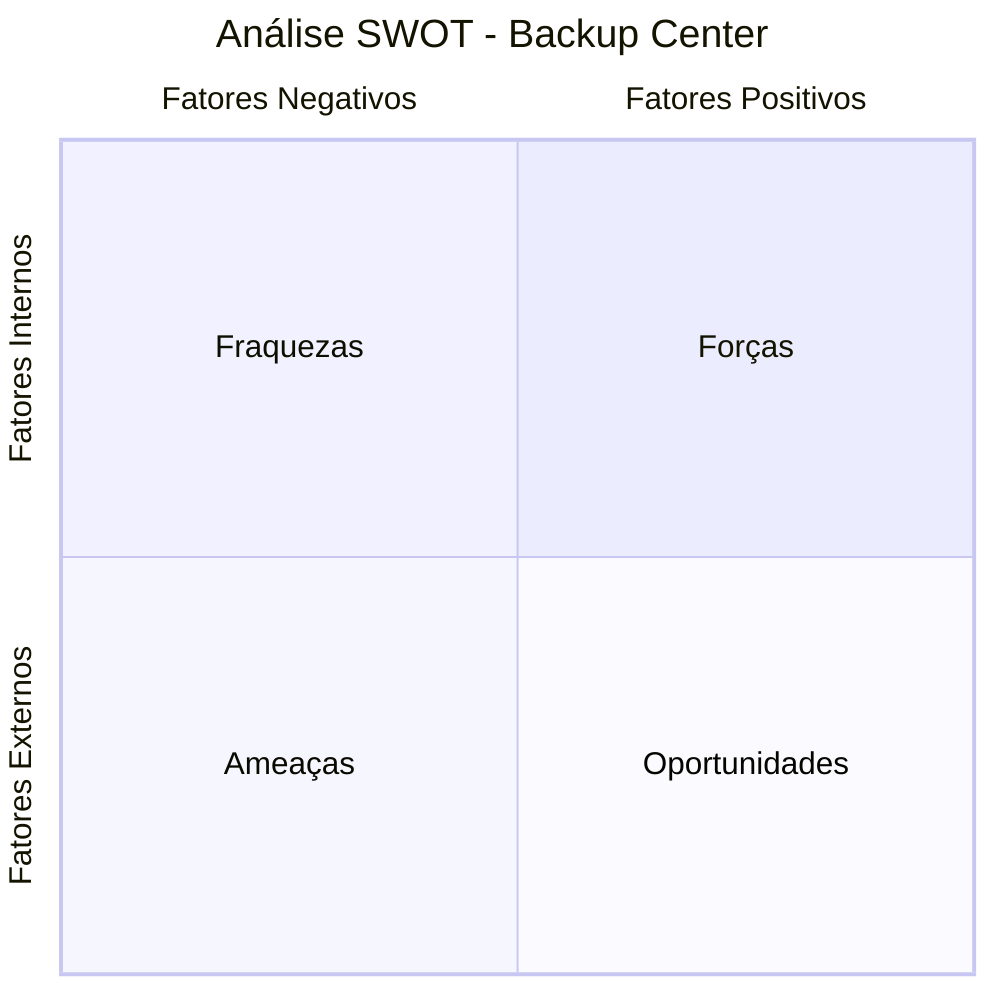

# 📊 Relatório de Análise Competitiva — Backup Center

> **Documento Estratégico — Uso Interno da Equipe**
> **Data:** 07 de Abril de 2026
> **Elaborado por:** Equipe de Produto & Engenharia
> **Classificação:** Confidencial

---

## Sumário Executivo

Este relatório apresenta uma análise completa do **Backup Center** — nossa plataforma de gerenciamento automatizado de backups de dispositivos de rede — comparando-a diretamente com as **10 principais soluções concorrentes** do mercado global de NCM (Network Configuration Management).

O objetivo é fornecer à equipe uma visão clara de **onde estamos**, **quem são nossos concorrentes**, **o que eles oferecem** e, principalmente, **o que precisamos construir** para nos posicionarmos como a plataforma líder mundial neste segmento.

---

## Parte I — O Backup Center

### 1.1 Visão Geral da Plataforma

O **Backup Center** é uma plataforma SaaS multi-tenant projetada especificamente para **Provedores de Internet (ISPs)**, empresas de telecomunicações e consultorias de infraestrutura de rede. Sua missão é automatizar completamente o ciclo de vida dos backups de configuração de equipamentos de rede — desde roteadores e switches até OLTs, firewalls e sistemas ERP de provedores.

A plataforma foi construída do zero como um produto moderno, utilizando uma stack tecnológica robusta e escalável, pensada para operar em produção com centenas de dispositivos simultâneos.

### 1.2 Stack Tecnológica

| Camada | Tecnologia | Propósito |
|--------|------------|-----------|
| **Backend** | Python (Flask + FastAPI) | Servidor web, API REST e renderização SSR |
| **Processamento Assíncrono** | Celery (14 workers paralelos) | Execução de backups em background |
| **Scheduler** | Celery Beat | Agendamento automático de tarefas periódicas |
| **Broker / Cache** | Redis 7 | Fila de mensagens e caching |
| **Banco de Dados** | PostgreSQL 15 | Persistência relacional completa |
| **Frontend** | Jinja2 Templates + TailwindCSS | Interface web responsiva |
| **Infraestrutura** | Docker Compose (12 serviços) | Orquestração de containers |
| **Observabilidade** | Prometheus + Grafana + Loki + Tempo | Métricas, logs centralizados e tracing distribuído |
| **Monitoramento de Tarefas** | Flower | Dashboard de monitoramento do Celery |

### 1.3 Arquitetura de Serviços (Docker Compose)

O sistema é composto por **12 microsserviços** orquestrados via Docker Compose:

```
┌──────────────────────────────────────────────────────────────┐
│                     BACKUP CENTER                            │
├──────────────────────────────────────────────────────────────┤
│                                                              │
│  ┌─────────────┐  ┌──────────────┐  ┌─────────────────────┐ │
│  │  Flask App   │  │  PostgreSQL  │  │       Redis         │ │
│  │  (Porta 5000)│  │  (Database)  │  │   (Broker/Cache)    │ │
│  └──────┬──────┘  └──────────────┘  └─────────────────────┘ │
│         │                                                    │
│  ┌──────┴─────────────────────────────────────────────────┐  │
│  │              Celery Workers (3 instâncias)             │  │
│  │  ┌──────────────┐ ┌────────────┐ ┌──────────────────┐  │  │
│  │  │ Worker Geral │ │ Worker VPN │ │   Celery Beat    │  │  │
│  │  │ (14 threads) │ │ (8 threads)│ │   (Scheduler)    │  │  │
│  │  └──────────────┘ └────────────┘ └──────────────────┘  │  │
│  └────────────────────────────────────────────────────────┘  │
│                                                              │
│  ┌────────────────────────────────────────────────────────┐  │
│  │           Stack de Observabilidade                     │  │
│  │  ┌────────────┐ ┌───────┐ ┌─────────┐ ┌───────────┐   │  │
│  │  │ Prometheus │ │ Loki  │ │ Promtail│ │   Tempo   │   │  │
│  │  └────────────┘ └───────┘ └─────────┘ └───────────┘   │  │
│  │                  ┌─────────┐ ┌────────┐                │  │
│  │                  │ Grafana │ │ Flower │                │  │
│  │                  └─────────┘ └────────┘                │  │
│  └────────────────────────────────────────────────────────┘  │
└──────────────────────────────────────────────────────────────┘
```

### 1.4 Funcionalidades Implementadas

#### 🔐 Multi-Tenancy Completo
- Isolamento total de dados entre organizações (tenants)
- Cada tenant possui seus próprios dispositivos, grupos, usuários e configurações
- Suporte a planos com limites configuráveis (dispositivos, usuários, storage, retenção)
- Gestão de assinaturas com estados: trial, active, past_due, canceled
- Sistema de billing com integração preparada para gateways de pagamento

#### 📡 Gestão de Dispositivos
- Cadastro completo de dispositivos de rede com criptografia de credenciais (Fernet)
- Organização hierárquica: **Grupos → Subgrupos → Dispositivos**
- Suporte a múltiplos protocolos de conexão: **SSH, Telnet e HTTP/API**
- Tags e metadados customizáveis por dispositivo
- Teste de conectividade integrado com diagnóstico detalhado

#### 🔄 Motor de Backup Automatizado
O coração do sistema é o **BackupExecutor** — um motor sofisticado que:
- Carrega dinamicamente scripts especializados por tipo de equipamento
- Suporta **60+ scripts de backup** para diferentes fabricantes e modelos
- Gera hash SHA-256 para integridade dos arquivos
- Armazena backups em estrutura organizada: `tenant/grupo/dispositivo/`
- Sistema de retenção automática com limpeza de backups expirados (Celery Beat)

#### 📋 Fabricantes e Equipamentos Suportados

| Categoria | Fabricantes/Modelos |
|-----------|-------------------|
| **Roteadores** | MikroTik RouterOS, Huawei NE, Cisco IOS/XE, Juniper JunOS |
| **OLTs** | Huawei MA5800, ZTE, FiberHome, VSOL, Datacom, CData, Furukawa, Intelbras, Parks, TP-Link, Nokia, Cianet, Ubiquiti, Digistar, Think, Shoreline, Unifibra, Maxprint, TPLink |
| **Switches** | Cisco, Huawei, Datacom, TP-Link JetStream, Aruba, Dell, Extreme, ZTE, Arista, Nokia, Juniper, Ubiquiti, Intelbras |
| **Firewalls** | Fortinet, pfSense, Check Point, SonicWall |
| **CGNAT** | A10, Hillstone, VCorp |
| **ERPs de ISP** | IXC Provedor, MK-Auth, Voalle, SGP, TopSAP |
| **Monitoramento** | Zabbix, Grafana (via API) |

#### 🌐 Modos de Conexão Avançados
O sistema suporta três modos de acesso aos equipamentos:

1. **Conexão Direta** — Acesso SSH/Telnet direto ao IP do dispositivo
2. **VPN L2TP/IPsec** — Túnel VPN automático via NetworkManager (nmcli), com lock global para evitar conflitos entre grupos. Worker dedicado (`celery_vpn`) com `NET_ADMIN` capability
3. **Jump Host (Bastion)** — Proxy SSH com suporte a autenticação por senha e chave privada (RSA, Ed25519, ECDSA, DSS). Fallback automático de porta para alvos em redes privadas. Sistema de slots com concorrência controlável por Jump Host

#### ⏰ Agendamento Inteligente
- Frequências: Diário, Semanal e Mensal
- Horário configurável por dispositivo (formato HH:MM)
- Verificação a cada minuto via Celery Beat
- Execução assíncrona que não bloqueia a interface

#### 📊 Dashboard e Relatórios
- Painel de visão geral com métricas de backups (sucessos, falhas, pendentes)
- Monitoramento de status de conectividade de dispositivos (ping a cada 5 minutos)
- Sistema de notificações (backup sucesso/falha, device offline, faturas, trial)
- Relatórios automáticos diários (8h) e semanais (segunda-feira, 9h)
- Logs de atividade do sistema

#### 🔒 Segurança
- RBAC (Controle de Acesso Baseado em Função) com decorators dedicados
- Proteção CSRF em todos os formulários
- Criptografia de senhas de usuário (bcrypt)
- Criptografia de credenciais de dispositivos (Fernet/AES)
- Rate limiting para proteção contra brute force
- Tokens de API para integrações externas

#### 🔍 Comparação de Configurações (Diff)
- Serviço de diff integrado para comparar versões de backup
- Normalização de conteúdo para ignorar linhas voláteis (timestamps, headers automáticos)
- Geração de hunks estruturados com contagem de linhas adicionadas/removidas
- Interface para seleção e comparação visual de backups

#### 📈 Observabilidade Completa
- **Prometheus**: Coleta de métricas de backup (duração, sucesso/falha, precheck)
- **Grafana**: Dashboards visuais de monitoramento
- **Loki + Promtail**: Agregação centralizada de logs de todos os containers
- **Tempo**: Tracing distribuído (OpenTelemetry) das operações de backup
- **Flower**: Monitoramento em tempo real das filas e workers do Celery

#### ⚙️ Resiliência e Inteligência Operacional
- **Network Precheck**: Validação de rede (ping + TCP) antes de iniciar o backup, com detecção de porta alternativa automática
- **Circuit Breaker**: Proteção contra cascata de falhas em Jump Hosts sobrecarregados
- **Adaptive Slots**: Ajuste dinâmico de concorrência por Jump Host baseado em taxa de falha
- **Retry Inteligente**: Re-tentativa automática para falhas transientes, com denylist por dispositivo
- **Classificação de Falhas**: Diagnóstico automático que categoriza erros (auth, timeout, connection, etc.)

---

## Parte II — Análise dos Concorrentes

### 2.1 Unimus

| Atributo | Detalhes |
|----------|----------|
| **Site** | [unimus.net](https://unimus.net/) |
| **Tipo** | Comercial SaaS / On-premise |
| **Foco** | ISPs e MSPs |
| **Preço** | A partir de ~$4/dispositivo/mês |

**O que faz:**
O Unimus é atualmente a referência moderna do mercado para backup automatizado de configuração de rede. Nasceu focado em ser simples, rápido de implantar e extremamente intuitivo.

**Funcionalidades principais:**
- ✅ Descoberta automática de fabricante/modelo (Vendor Discovery)
- ✅ Diff visual lado a lado de configurações com histórico completo
- ✅ Push de comandos em massa para múltiplos dispositivos
- ✅ Notificações de alteração de configuração em tempo real
- ✅ Suporte a 200+ tipos de dispositivos nativamente
- ✅ API REST completa
- ✅ Relatórios de compliance e auditoria
- ✅ Interface web moderna e responsiva
- ❌ Não é multi-tenant nativo (cada instância é isolada)
- ❌ Sem VPN integrada — exige que o cliente exponha as portas

---

### 2.2 Oxidized

| Atributo | Detalhes |
|----------|----------|
| **Repositório** | [github.com/ytti/oxidized](https://github.com/ytti/oxidized) |
| **Tipo** | Open Source (Ruby) |
| **Foco** | SysAdmins e engenheiros de rede |
| **Preço** | Gratuito |

**O que faz:**
O Oxidized é o substituto moderno do histórico RANCID. Ele coleta configurações de rede e as versiona em repositórios Git. É extremamente robusto, mas puramente técnico — sem interface gráfica própria.

**Funcionalidades principais:**
- ✅ Suporte a 130+ tipos de dispositivos
- ✅ Versionamento via Git (cada backup é um commit)
- ✅ Integração com LibreNMS para visualização
- ✅ Hooks customizáveis (executar ações pós-backup)
- ✅ API REST básica
- ❌ Sem interface web própria
- ❌ Sem agendamento visual — tudo via configuração YAML
- ❌ Sem diff visual integrado
- ❌ Requer conhecimento avançado de Linux
- ❌ Sem multi-tenancy

---

### 2.3 rConfig

| Atributo | Detalhes |
|----------|----------|
| **Site** | [rconfig.com](https://www.rconfig.com/) |
| **Tipo** | Open Source / Comercial (Enterprise) |
| **Foco** | Gestores de rede em geral |
| **Preço** | Gratuito (CE) / Enterprise pago |

**O que faz:**
O rConfig é uma ferramenta NCM baseada em PHP com interface web embarcada para gerenciar dispositivos de rede e seus backups de configuração.

**Funcionalidades principais:**
- ✅ Interface web nativa para gestão de dispositivos
- ✅ Templates de comandos por tipo de dispositivo
- ✅ Agendamento via Cron Jobs
- ✅ Comparação de configurações
- ✅ Tags e categorização de dispositivos
- ❌ Tecnologia datada (PHP + jQuery)
- ❌ Interface com design antigo
- ❌ Sem multi-tenancy
- ❌ Sem suporte a VPN ou Jump Host
- ❌ Poucas integrações nativas

---

### 2.4 SolarWinds Network Configuration Manager

| Atributo | Detalhes |
|----------|----------|
| **Site** | [solarwinds.com/network-configuration-manager](https://www.solarwinds.com/network-configuration-manager) |
| **Tipo** | Enterprise (On-premise) |
| **Foco** | Grandes corporações, bancos, hospitais |
| **Preço** | A partir de ~$1,700/licença (+ manutenção anual) |

**O que faz:**
Um dos gigantes do mercado de TI corporativa. Oferece uma solução NCM completa integrada ao ecossistema Orion Platform com dezenas de módulos complementares.

**Funcionalidades principais:**
- ✅ Auditoria de vulnerabilidades (CVE) automática
- ✅ Compliance automatizado (NIST, HIPAA, PCI-DSS)
- ✅ Rollback de configuração com um clique
- ✅ Bulk push de configurações
- ✅ Diff avançado com histórico auditável
- ✅ Integração com ITSM (ServiceNow, Jira)
- ✅ Relatórios executivos e dashboards
- ❌ Custo proibitivo para ISPs regionais
- ❌ Complexidade absurda de implantação (semanas)
- ❌ Interface pesada e pouco intuitiva
- ❌ Exige infraestrutura Windows Server

---

### 2.5 ManageEngine Network Configuration Manager

| Atributo | Detalhes |
|----------|----------|
| **Site** | [manageengine.com/network-configuration-manager](https://www.manageengine.com/network-configuration-manager/) |
| **Tipo** | Enterprise (On-premise / SaaS) |
| **Foco** | Corporações de médio e grande porte |
| **Preço** | A partir de ~$595/ano (até 10 devices) |

**O que faz:**
Solução ITSM completa da Zoho Corporation. Forte ênfase em auditoria, compliance e gestão de mudanças (change management).

**Funcionalidades principais:**
- ✅ Gestão de mudanças com workflows de aprovação
- ✅ Compliance com templates pré-configurados
- ✅ Integração com ServiceDesk Plus
- ✅ Bulk push de configurações
- ✅ Relatórios de auditoria (SOX, PCI)
- ✅ Detecção de conflitos de configuração
- ❌ Interface carregada e visualmente datada
- ❌ Muitos módulos são vendidos separadamente
- ❌ Foco corporativo que não atende bem ISPs
- ❌ Implantação e configuração complexas

---

### 2.6 Auvik

| Atributo | Detalhes |
|----------|----------|
| **Site** | [auvik.com](https://www.auvik.com/) |
| **Tipo** | Cloud SaaS |
| **Foco** | MSPs e ISPs modernos |
| **Preço** | Não publicado (~$150+/mês estimado) |

**O que faz:**
Plataforma de monitoramento de rede baseada em nuvem com destaque para mapeamento automático de topologia e backup de configurações como funcionalidade integrada.

**Funcionalidades principais:**
- ✅ Mapeamento automático de topologia (SNMP/LLDP/CDP)
- ✅ Backup automático de configurações em tempo real
- ✅ Alertas de alteração de configuração
- ✅ Interface moderna e extremamente polida
- ✅ Collector local (agente leve instalado na rede do cliente)
- ✅ Multi-tenant nativo com gestão de clientes
- ✅ Dashboards visuais interativos
- ❌ Custo altíssimo (impraticável para ISPs regionais)
- ❌ Dependência total de nuvem (sem opção on-premise)
- ❌ Foco amplo (não é especialista em backup)

---

### 2.7 Ansible + AWX / Semaphore

| Atributo | Detalhes |
|----------|----------|
| **Repositório** | [github.com/ansible/awx](https://github.com/ansible/awx) |
| **Tipo** | Open Source (abordagem DevOps) |
| **Foco** | Times de engenharia com desenvolvedores |
| **Preço** | Gratuito |

**O que faz:**
Não é um produto pronto, mas uma *abordagem*. Equipes de engenharia escrevem playbooks Ansible que automatizam a coleta de configurações. AWX e Semaphore adicionam interfaces web para disparar e monitorar essas automações.

**Funcionalidades principais:**
- ✅ Flexibilidade infinita (pode fazer qualquer coisa)
- ✅ Suporte a praticamente qualquer dispositivo
- ✅ Versionamento natural via Git
- ✅ Integração com CI/CD
- ✅ Comunidade gigantesca
- ❌ Exige programadores no time
- ❌ Sem UI amigável para gestores não técnicos
- ❌ Custo alto de manutenção e documentação interna
- ❌ Sem multi-tenancy nativo

---

### 2.8 NetBox (com plugins de backup)

| Atributo | Detalhes |
|----------|----------|
| **Site** | [netbox.dev](https://netbox.dev/) |
| **Tipo** | Open Source (Python/Django) |
| **Foco** | Documentação de infraestrutura (IPAM/DCIM) |
| **Preço** | Gratuito |

**O que faz:**
Criado pela DigitalOcean, o NetBox é o padrão de mercado para documentação de redes e data centers. Através de plugins como `netbox-config-backup` e integrações com NAPALM, ele pode armazenar e versionar configurações de rede.

**Funcionalidades principais:**
- ✅ Fonte da verdade para IPAM (gestão de IPs) e DCIM (gestão de data center)
- ✅ API REST excepcional
- ✅ Ecosistema de plugins em expansão
- ✅ Integração com NAPALM para coleta de configurações
- ✅ Interface moderna (Django)
- ❌ Backup de configuração não é o foco principal
- ❌ Plugins de backup ainda imaturos
- ❌ Complexo para quem quer "apenas" fazer backup
- ❌ Sem multi-tenancy no sentido SaaS

---

### 2.9 BackBox

| Atributo | Detalhes |
|----------|----------|
| **Site** | [backbox.com](https://backbox.com/) |
| **Tipo** | Comercial SaaS |
| **Foco** | Backup de segurança (firewalls e infraestrutura crítica) |
| **Preço** | Não publicado (enterprise) |

**O que faz:**
Focado fanaticamente na recuperação de desastres e segurança de rede. Especialista em firewalls (Palo Alto, Fortinet, Check Point) com verificação de integridade de backup e automação de disaster recovery.

**Funcionalidades principais:**
- ✅ Verificação automática de integridade dos backups
- ✅ Testes de restore automatizados
- ✅ Especialista em firewalls e equipamentos de segurança
- ✅ Automação de disaster recovery
- ✅ Compliance de segurança (SOC 2, ISO 27001)
- ❌ Nicho muito estreito (quase exclusivamente segurança)
- ❌ Sem foco em ISPs
- ❌ Custo enterprise
- ❌ Suporte limitado a equipamentos de provedor (OLTs, ERPs)

---

### 2.10 Cisco NSO (Network Services Orchestrator)

| Atributo | Detalhes |
|----------|----------|
| **Site** | [cisco.com/c/en/us/products/cloud-systems-management/network-services-orchestrator](https://www.cisco.com/c/en/us/products/cloud-systems-management/network-services-orchestrator/index.html) |
| **Tipo** | Enterprise (Plataforma de Orquestração) |
| **Foco** | Grandes operadoras de telecom (Tier 1/2) |
| **Preço** | Dezenas de milhares de dólares/ano |

**O que faz:**
A ferramenta definitiva para orquestração de redes em escala massiva. Utilizada por operadoras como Telefônica, AT&T e Claro para configurar milhões de dispositivos simultaneamente com garantia de idempotência (capacidade de desfazer alterações parciais automaticamente).

**Funcionalidades principais:**
- ✅ Orquestração em escala massiva (milhões de dispositivos)
- ✅ Modelagem com YANG para abstração multi-vendor
- ✅ Idempotência e rollback atômico
- ✅ Transações de rede (tudo ou nada)
- ✅ Integração com toda a linha Cisco
- ❌ Complexidade absurda — requer equipe especializada
- ❌ Custo proibitivo (fora da realidade de ISPs)
- ❌ Necessita de meses para implantação
- ❌ Vendor lock-in significativo

---

## Parte III — Ranking Competitivo (Cenário: Todos Gratuitos)

Para esta classificação, removemos completamente o fator preço da equação. O ranking é baseado puramente em **capacidade funcional**, **experiência do usuário**, **amplitude de suporte a dispositivos** e **maturidade da plataforma**.

### 🏆 Ranking Geral

| Posição | Sistema | Pontuação | Justificativa |
|:-------:|---------|:---------:|---------------|
| **1º** | **Auvik** | ⭐⭐⭐⭐⭐ | Mapeamento automático de topologia, interface de classe mundial, collector local, multi-tenant nativo. Se fosse gratuito, seria imbatível pela experiência completa que oferece. |
| **2º** | **SolarWinds NCM** | ⭐⭐⭐⭐½ | Décadas de investimento em R&D. Compliance avançado (CVE, NIST, PCI), rollback atômico, integrações ITSM massivas. A única barreira é a complexidade — mas se é gratuito, corporações adotariam em massa. |
| **3º** | **Unimus** | ⭐⭐⭐⭐ | O melhor equilíbrio entre poder e simplicidade. Vendor discovery automático, push de comandos em massa, diff visual impecável. Mantém-se alto porque "simples de usar" vale ouro no dia a dia. |
| **4º** | **Backup Center** | ⭐⭐⭐½ | Multi-tenancy nativo (raro neste mercado), 60+ scripts de backup, VPN e Jump Host integrados, observabilidade completa com Prometheus/Grafana/Loki/Tempo. Falta polish em UX e features premium para subir. |
| **5º** | **ManageEngine NCM** | ⭐⭐⭐ | Workflows de aprovação e compliance sólidos, mas interface datada e experiência de uso inferior à do Backup Center e Unimus para o público ISP. |
| **6º** | **BackBox** | ⭐⭐⭐ | Excepcional no nicho de segurança/firewalls, mas escopo muito restrito para competir como solução general-purpose de NCM. |
| **7º** | **Oxidized** | ⭐⭐½ | Robusto e confiável para quem domina CLI, mas a ausência total de interface gráfica o limita severamente em um mundo onde gestores querem clicar em botões. |
| **8º** | **NetBox** | ⭐⭐½ | Excelente como IPAM/DCIM, mas backup de configuração é um "plug-in" secundário, não o core do produto. |
| **9º** | **Ansible + AWX** | ⭐⭐ | Poder infinito, mas custo operacional gigantesco. Requer desenvolvedores dedicados. Não é uma ferramenta — é um framework. |
| **10º** | **rConfig** | ⭐⭐ | Funcional, mas tecnologicamente ultrapassado. Em um cenário onde tudo é gratuito, não haveria razão para escolhê-lo sobre o Unimus ou o Backup Center. |
| **11º** | **Cisco NSO** | ⭐½ | Absurdamente poderoso, mas projetado para outro universo (telecom Tier 1). Mesmo gratuito, 99% dos ISPs não teriam como operá-lo. |

### Análise Visual do Posicionamento

```
                    SIMPLICIDADE DE USO
                          ▲
                          │
              Unimus ●    │
                          │    ● Backup Center
                          │
         rConfig ●        │              ● Auvik
                          │
                          ├──────────────────────────► PODER FUNCIONAL
                          │
         Oxidized ●       │         ● ManageEngine
                          │
        Ansible ●         │    ● SolarWinds
                          │
                          │              ● Cisco NSO
                          │
```

---

## Parte IV — Matriz Comparativa de Features (Lado a Lado)

A tabela abaixo permite a visualização instantânea de onde cada sistema se destaca e onde possui lacunas. Use-a como referência rápida em reuniões de produto.

**Legenda:** ✅ Implementado | 🔶 Parcial/Básico | ❌ Ausente

### 4.1 Features de Core (Backup & Gestão)

| Feature | Backup Center | Unimus | Oxidized | rConfig | SolarWinds | ManageEngine | Auvik |
|---------|:---:|:---:|:---:|:---:|:---:|:---:|:---:|
| Backup automatizado por agendamento | ✅ | ✅ | ✅ | ✅ | ✅ | ✅ | ✅ |
| Backup manual sob demanda | ✅ | ✅ | 🔶 | ✅ | ✅ | ✅ | ✅ |
| Diff visual de configurações | 🔶 | ✅ | ❌ | 🔶 | ✅ | ✅ | ✅ |
| Push de comandos em massa | ❌ | ✅ | ❌ | 🔶 | ✅ | ✅ | ❌ |
| Rollback de configuração | ❌ | ❌ | ❌ | ❌ | ✅ | ✅ | ❌ |
| Auto-descoberta de vendor | ❌ | ✅ | 🔶 | ❌ | ✅ | ✅ | ✅ |
| Retenção automática de backups | ✅ | ✅ | 🔶 | 🔶 | ✅ | ✅ | ✅ |
| Hash de integridade (SHA-256) | ✅ | ✅ | ❌ | ❌ | ✅ | 🔶 | 🔶 |
| Logs de backup em tempo real | ✅ | 🔶 | ❌ | ❌ | 🔶 | ❌ | 🔶 |

### 4.2 Features de Conectividade

| Feature | Backup Center | Unimus | Oxidized | rConfig | SolarWinds | ManageEngine | Auvik |
|---------|:---:|:---:|:---:|:---:|:---:|:---:|:---:|
| Conexão SSH | ✅ | ✅ | ✅ | ✅ | ✅ | ✅ | ✅ |
| Conexão Telnet | ✅ | ✅ | ✅ | ✅ | ✅ | ✅ | 🔶 |
| Conexão HTTP/API (Grafana, Zabbix) | ✅ | ❌ | ❌ | ❌ | 🔶 | 🔶 | ✅ |
| VPN L2TP/IPsec integrada | ✅ | ❌ | ❌ | ❌ | ❌ | ❌ | ❌ |
| Jump Host / Bastion SSH | ✅ | 🔶 | ❌ | ❌ | ✅ | 🔶 | ❌ |
| Collector/Sonda local | ❌ | ❌ | ❌ | ❌ | 🔶 | ❌ | ✅ |
| Teste de conectividade integrado | ✅ | ✅ | ❌ | ❌ | ✅ | 🔶 | ✅ |
| Network precheck pré-backup | ✅ | ❌ | ❌ | ❌ | ❌ | ❌ | ❌ |

### 4.3 Features de Plataforma & Negócio

| Feature | Backup Center | Unimus | Oxidized | rConfig | SolarWinds | ManageEngine | Auvik |
|---------|:---:|:---:|:---:|:---:|:---:|:---:|:---:|
| Multi-tenancy nativo | ✅ | ❌ | ❌ | ❌ | ❌ | ❌ | ✅ |
| RBAC (controle de acesso por função) | ✅ | ✅ | ❌ | 🔶 | ✅ | ✅ | ✅ |
| Planos e billing integrado | ✅ | ❌ | ❌ | ❌ | ❌ | ❌ | ❌ |
| API REST | 🔶 | ✅ | 🔶 | 🔶 | ✅ | ✅ | ✅ |
| Webhooks | ❌ | ✅ | ❌ | ❌ | ✅ | ✅ | ✅ |
| Interface web moderna | ✅ | ✅ | ❌ | 🔶 | 🔶 | 🔶 | ✅ |
| Grupos e subgrupos de dispositivos | ✅ | 🔶 | ❌ | 🔶 | ✅ | ✅ | ✅ |
| Tags customizáveis | ✅ | ✅ | ❌ | ✅ | ✅ | 🔶 | ✅ |

### 4.4 Features de Segurança & Compliance

| Feature | Backup Center | Unimus | Oxidized | rConfig | SolarWinds | ManageEngine | Auvik |
|---------|:---:|:---:|:---:|:---:|:---:|:---:|:---:|
| Criptografia de credenciais | ✅ | ✅ | ❌ | 🔶 | ✅ | ✅ | ✅ |
| Proteção CSRF | ✅ | ✅ | ❌ | 🔶 | ✅ | ✅ | ✅ |
| Rate limiting | ✅ | ✅ | ❌ | ❌ | ✅ | ✅ | ✅ |
| Auditoria de vulnerabilidades (CVE) | ❌ | ❌ | ❌ | ❌ | ✅ | ✅ | ❌ |
| Compliance automatizado | ❌ | ❌ | ❌ | ❌ | ✅ | ✅ | ❌ |
| Workflows de aprovação | ❌ | ❌ | ❌ | ❌ | ✅ | ✅ | ❌ |
| Detecção de drift (config change) | ❌ | ✅ | ❌ | ❌ | ✅ | ✅ | ✅ |

### 4.5 Features de Observabilidade & Monitoramento

| Feature | Backup Center | Unimus | Oxidized | rConfig | SolarWinds | ManageEngine | Auvik |
|---------|:---:|:---:|:---:|:---:|:---:|:---:|:---:|
| Métricas Prometheus nativas | ✅ | ❌ | ❌ | ❌ | 🔶 | ❌ | ❌ |
| Dashboards Grafana integrados | ✅ | ❌ | ❌ | ❌ | 🔶 | ❌ | ✅ |
| Logs centralizados (Loki) | ✅ | ❌ | ❌ | ❌ | 🔶 | 🔶 | 🔶 |
| Tracing distribuído (OpenTelemetry) | ✅ | ❌ | ❌ | ❌ | ❌ | ❌ | ❌ |
| Monitoramento de tasks (Flower) | ✅ | ❌ | ❌ | ❌ | ❌ | ❌ | ❌ |
| Ping/monitoring de dispositivos | ✅ | ✅ | ❌ | ❌ | ✅ | ✅ | ✅ |
| Mapeamento de topologia | ❌ | ❌ | ❌ | ❌ | ✅ | 🔶 | ✅ |

### 4.6 Resumo de Contagem

| Sistema | ✅ Total | 🔶 Parcial | ❌ Ausente | % Cobertura |
|---------|:--------:|:----------:|:---------:|:-----------:|
| **SolarWinds NCM** | 30 | 5 | 5 | **81%** |
| **Auvik** | 26 | 6 | 8 | **73%** |
| **Backup Center** | 26 | 3 | 11 | **69%** |
| **ManageEngine NCM** | 23 | 8 | 9 | **68%** |
| **Unimus** | 22 | 5 | 13 | **61%** |
| **rConfig** | 8 | 10 | 22 | **33%** |
| **Oxidized** | 5 | 3 | 32 | **16%** |

> [!NOTE]
> O Backup Center já se posiciona em **3º lugar em cobertura de features** (69%), empatando tecnicamente com o Auvik (73%). A diferença está concentrada em features de compliance/segurança e mapeamento de topologia — exatamente o que o Roadmap das Fases 2 e 3 endereça.

---

## Parte V — Análise SWOT do Backup Center

A análise SWOT (Strengths, Weaknesses, Opportunities, Threats) oferece uma visão estratégica estruturada da posição competitiva do Backup Center no mercado.



### 💪 FORÇAS (Strengths) — Fatores Internos Positivos

| # | Força | Impacto Estratégico |
|:-:|-------|-------------------|
| S1 | **Multi-Tenancy nativo** — Arquitetura projetada do zero para isolar dados entre organizações | Permite modelo SaaS escalável. Consultorias de rede podem gerenciar múltiplos ISPs em uma instância. **Nenhum concorrente direto (Unimus, rConfig, Oxidized) oferece isso.** |
| S2 | **VPN L2TP/IPsec + Jump Host integrados** — Worker dedicado com NET_ADMIN, lock global e slots por Jump Host | Resolve o maior problema de ISPs: acessar equipamentos atrás de NAT/firewall sem exigir configuração manual do cliente. **Diferenciador único no mercado.** |
| S3 | **60+ scripts de backup incluindo fabricantes brasileiros** — IXC, MK-Auth, Voalle, SGP, CData, Datacom, Parks, FiberHome, VSOL | Atende um mercado que os concorrentes internacionais ignoram completamente. ISPs brasileiros usam equipamentos que o Unimus e o SolarWinds nem sabem que existem. |
| S4 | **Observabilidade de classe enterprise** — Prometheus + Grafana + Loki + Tempo + Flower nativos | Stack que grandes empresas levam meses para implementar já vem pronta. Permite debugging avançado de falhas de backup e operação proativa. |
| S5 | **Stack moderna e extensível** — Python/Flask + Celery + Redis + PostgreSQL em Docker | Facilidade de adicionar novos scripts de backup, novas features e escalar horizontalmente. Curva de aprendizado baixa para novos desenvolvedores Python. |
| S6 | **Motor de resiliência sofisticado** — Circuit breaker, adaptive slots, network precheck, retry inteligente, fallback de porta | Maximiza a taxa de sucesso em ambientes de rede instáveis (realidade de ISPs regionais). Mecanismos que nenhum concorrente oferece. |
| S7 | **Sistema de billing pronto** — Planos, limites, trial, faturamento com estados de assinatura | Infraestrutura de monetização já existe. Basta conectar um gateway de pagamento para começar a cobrar. |

### 📉 FRAQUEZAS (Weaknesses) — Fatores Internos Negativos

| # | Fraqueza | Impacto | Mitigação Proposta |
|:-:|---------|---------|-------------------|
| W1 | **Dashboard com dados mockados** — Algumas métricas usam valores fixos em vez de queries reais | Passa impressão de produto incompleto | Fase 5 do Roadmap — substituir por dados reais |
| W2 | **Ausência de push de comandos em massa** — Feature presente no Unimus e SolarWinds | Perde para o concorrente direto (Unimus) na funcionalidade mais requisitada por gestores | Fase 1 do Roadmap — implementar urgentemente |
| W3 | **Diff visual básico** — O serviço existe, mas a interface precisa de polish premium | Não convence o gestor que avalia lado a lado com o Unimus | Fase 1 do Roadmap — interface GitHub-like |
| W4 | **Testes automatizados ausentes** — Sem cobertura de testes unitários ou de integração | Alto risco de regressão em cada deploy. Reduz confiança do time | Implementar testes prioritários para fluxos críticos |
| W5 | **Forgot Password não funcional** — Fluxo de reset de senha é mock | Usuários não conseguem recuperar acesso de forma autônoma | Fase 5 do Roadmap — implementar com envio real de e-mail |
| W6 | **Scripts de backup incompletos** — Parte dos 60+ scripts retorna stubs | Falha silenciosa para alguns tipos de equipamento | Priorizar scripts dos equipamentos mais usados pelos clientes |
| W7 | **Sem auto-descoberta de vendor** — Exige seleção manual do tipo de equipamento no cadastro | Fricção desnecessária no onboarding de novos dispositivos | Fase 1 do Roadmap |

### 🌟 OPORTUNIDADES (Opportunities) — Fatores Externos Positivos

| # | Oportunidade | Potencial de Mercado |
|:-:|-------------|---------------------|
| O1 | **Mercado brasileiro de ISPs em explosão** — O Brasil tem 20.000+ provedores regionais e o número cresce anualmente | Mercado gigantesco, mal atendido, com barreira de idioma que protege contra concorrentes internacionais. Nenhum concorrente NCM tem suporte a equipamentos e ERPs brasileiros. |
| O2 | **Regulamentação da Anatel cada vez mais rígida** — Exigências de documentação, backup e compliance crescem todo ano | ISPs que não têm gestão de configuração de rede documentada estão em risco regulatório. O Backup Center pode se posicionar como "ferramenta de compliance Anatel". |
| O3 | **Modelo SaaS com preço em Real** — Concorrentes cobram em dólar. Flutuação cambial torna soluções internacionais cada vez mais caras | Cobrar em Real com preço fixo previsível é uma **vantagem comercial brutal** para ISPs regionais com orçamento apertado. |
| O4 | **Parcerias com integradores e distribuidores de equipamentos** — FiberHome, Huawei, Datacom, Parks já vendem para ISPs brasileiros | Parcerias para embutir o Backup Center como ferramenta recomendada junto com a venda de hardware. |
| O5 | **Movimento "Cloud-First" dos ISPs** — Provedores migrando de soluções on-premise para SaaS | Janela de mercado para capturar ISPs que estão abandonando scripts manuais e planilhas Excel em troca de plataformas web. |
| O6 | **Integração com NetBox como IPAM/DCIM** — O NetBox é o padrão open-source para documentação de rede | Oferecer integração nativa com NetBox posiciona o Backup Center como "a peça que faltava" no ecossistema de automação de redes. |

### ⚠️ AMEAÇAS (Threats) — Fatores Externos Negativos

| # | Ameaça | Nível de Risco | Estratégia Defensiva |
|:-:|--------|:--------------:|---------------------|
| T1 | **Unimus lançar multi-tenancy** — Se o Unimus adicionar multi-tenancy, elimina nossa principal vantagem | 🟡 Médio | Acelerar a Fase 1 para ter paridade funcional antes disso acontecer |
| T2 | **Entrada de player brasileiro no mercado** — Uma empresa nacional clonando o conceito com time de vendas agressivo | 🟡 Médio | Construir base de clientes e reputação rapidamente (first-mover advantage) |
| T3 | **Fabricantes embutindo backup nativo** — MikroTik, Huawei ou outros lançarem backup centralizado integrado ao firmware | 🔴 Alto | Diversificar valor além de "apenas backup" (compliance, topologia, mass push) |
| T4 | **Oxidized ganhar interface web boa** — A comunidade open-source eventualmente criando uma GUI premium para o Oxidized | 🟢 Baixo | O modelo open-source puro dificilmente entregará UX e suporte comercial no nível que ISPs exigem |
| T5 | **Instabilidade de dependências** — Netmiko, Paramiko ou outras libs Python quebrando compatibilidade em updates | 🟢 Baixo | Fixar versões no requirements.txt e ter suite de testes para detectar breaking changes |

---

## Parte VI — Estratégia de Precificação

### 6.1 Análise de Preços dos Concorrentes

| Concorrente | Modelo de Cobrança | Preço (USD) | Preço Equivalente (BRL*) | Público |
|-------------|-------------------|-------------|:------------------------:|---------|
| **Unimus** | Por dispositivo/mês | ~$4/device/mês | ~R$22/device/mês | ISPs/MSPs |
| **rConfig** | Gratuito (CE) / Enterprise | $0 — $499/ano | R$0 — R$2.700/ano | Geral |
| **ManageEngine** | Por dispositivo/ano | ~$595/10 devices/ano | ~R$3.200/ano (10 dev) | Corporate |
| **SolarWinds** | Licença perpétua + manutenção | ~$1,700+ uma vez | ~R$9.200+ uma vez | Enterprise |
| **Auvik** | Por dispositivo/mês (SaaS) | ~$150+/mês (estimado) | ~R$810+/mês | MSPs |
| **BackBox** | Enterprise (cotação) | Não publicado | Sob consulta | Enterprise |
| **Oxidized** | Open Source | $0 | R$0 | DevOps |

*\*Câmbio estimado: 1 USD = R$5,40*

### 6.2 Estratégia de Preço Recomendada para o Backup Center

> [!IMPORTANT]
> A estratégia deve explorar a vantagem de **cobrar em Real (BRL)** com preço fixo e previsível, enquanto concorrentes internacionais flutuam com o câmbio.

#### Modelo Recomendado: Por Plano com Tiers de Dispositivos

| Plano | Dispositivos | Usuários | Retenção | Storage | Preço Mensal Sugerido | Preço Anual Sugerido |
|-------|:-----------:|:--------:|:--------:|:-------:|:---------------------:|:--------------------:|
| **Starter** | Até 25 | 2 | 30 dias | 5 GB | R$149/mês | R$1.490/ano (17% off) |
| **Professional** | Até 100 | 5 | 60 dias | 20 GB | R$349/mês | R$3.490/ano (17% off) |
| **Business** | Até 300 | 10 | 90 dias | 50 GB | R$699/mês | R$6.990/ano (17% off) |
| **Enterprise** | Ilimitado | Ilimitado | 180 dias | 200 GB | R$1.499/mês | R$14.990/ano (17% off) |
| **Trial** | Até 10 | 2 | 14 dias | 2 GB | **Gratuito (14 dias)** | — |

#### 6.3 Justificativa da Precificação

**Comparação direta com o Unimus (principal concorrente):**

| Cenário | Unimus (USD → BRL) | Backup Center (BRL) | Economia |
|---------|:-------------------:|:-------------------:|:--------:|
| 25 dispositivos | R$2.970/ano ($4×25×12) | R$1.490/ano | **50% mais barato** |
| 100 dispositivos | R$25.920/ano ($4×100×12) | R$3.490/ano | **87% mais barato** |
| 300 dispositivos | R$77.760/ano ($4×300×12) | R$6.990/ano | **91% mais barato** |

> [!TIP]
> **Argumento de venda matador:** *"Com 100 dispositivos no Unimus, você paga quase R$26.000 por ano em dólar — e esse preço sobe com o câmbio. No Backup Center, o mesmo cenário custa R$3.490 por ano, em Real, com preço fixo. São R$22.000 de economia por ano."*

#### 6.4 Estratégias Complementares de Monetização

| Estratégia | Descrição | Potencial |
|------------|-----------|:---------:|
| **Freemium** | Manter o plano Trial permanente (até 5 dispositivos, features básicas) para atrair ISPs pequenos que crescem e migram para planos pagos | 🔴 Alto |
| **Desconto para parceiros** | Desconto de 30% para integradores e distribuidores de hardware que revenderem o Backup Center junto com equipamentos | 🟡 Médio |
| **Add-ons premium** | Cobrar separadamente por funcionalidades avançadas: Mapeamento de Topologia (+R$199/mês), Compliance Pack (+R$149/mês), API Avançada (+R$99/mês) | 🟡 Médio |
| **Consultoria de onboarding** | Serviço pago de implantação acompanhada (R$2.000-5.000) para ISPs que querem migrar seus backups manuais para o Backup Center | 🟢 Baixo |
| **White-Label para consultorias** | Permitir que consultorias vendam o Backup Center com a própria marca por um fee mensal adicional (+50% sobre o plano) | 🟡 Médio |

---

## Parte VII — Roadmap Estratégico: O Caminho para o 1º Lugar

Para o **Backup Center** alcançar a posição de líder absoluto, identificamos **5 fases estratégicas**, organizadas por impacto no ranking e viabilidade técnica.

> [!IMPORTANT]
> As fases são sequenciais e cumulativas. Cada fase concluída move o Backup Center para cima no ranking.

---

### 🎯 Fase 1 — Paridade com o Unimus (4º → 3º lugar)
**Prazo estimado:** 4-6 semanas
**Impacto:** Elimina a principal vantagem do concorrente direto

| Feature | Descrição | Prioridade |
|---------|-----------|:----------:|
| **Push de Comandos em Massa** | Interface onde o usuário digita comandos, seleciona N dispositivos, e o Celery dispara scripts SSH que aplicam a configuração em todos simultaneamente | 🔴 Crítica |
| **Diff Visual Premium** | Tela estilo GitHub/GitLab com linhas vermelhas (removidas) e verdes (adicionadas), numeração, contexto de mudança, filtros por tipo. O serviço `diff_service.py` já existe — falta a interface visual premium | 🔴 Crítica |
| **Auto-descoberta de Vendor** | Ao cadastrar um dispositivo com IP + credencial, o sistema loga via SSH, executa comandos de sondagem e identifica automaticamente a marca/modelo, preenchendo o tipo de dispositivo sem intervenção manual | 🟡 Alta |

---

### 🎯 Fase 2 — Superar Enterprise (3º → 2º lugar)
**Prazo estimado:** 6-8 semanas
**Impacto:** Oferece funcionalidades que hoje são exclusivas de soluções de milhares de dólares

| Feature | Descrição | Prioridade |
|---------|-----------|:----------:|
| **Auditoria de Segurança Ativa** | Script Python que analisa os backups coletados buscando: senhas em texto puro, serviços vulneráveis (Telnet aberto, SNMP v1), firewalls com regras permissivas demais. Gera alertas automáticos | 🔴 Crítica |
| **Workflows de Aprovação** | Módulo onde o "Analista" agenda um push de comandos, e o sistema retém a execução até que o "Engenheiro Sênior" aprove via interface. Controle de change management | 🟡 Alta |
| **Rollback de Configuração** | Capacidade de selecionar um backup anterior e aplicá-lo de volta no dispositivo via SSH, revertendo alterações indesejadas | 🟡 Alta |
| **Relatórios de Compliance** | Templates de verificação (ex: "Todos os equipamentos devem ter SSH habilitado e Telnet desabilitado") que geram um relatório de conformidade exportável em PDF | 🟢 Média |

---

### 🎯 Fase 3 — Alcançar o Auvik (2º → 1º lugar)
**Prazo estimado:** 8-12 semanas
**Impacto:** Funcionalidades que hoje são exclusivas do produto mais caro do mercado

| Feature | Descrição | Prioridade |
|---------|-----------|:----------:|
| **Mapeamento de Topologia** | Motor que executa consultas SNMP, LLDP e CDP nos equipamentos, extrai tabelas de vizinhança e usa bibliotecas JavaScript (como D3.js ou Cytoscape.js) para desenhar automaticamente um mapa interativo da rede | 🔴 Crítica |
| **Collector Local (Sonda)** | Pacote Docker leve ou script Python que o cliente instala dentro da sua rede. O collector acessa os equipamentos localmente (sem necessidade de abrir portas no firewall) e envia os backups via HTTPS/API para a nuvem do Backup Center | 🔴 Crítica |
| **Detecção de Drift** | Monitoramento contínuo que compara o backup mais recente com o anterior e notifica o gestor em tempo real quando uma configuração muda inesperadamente | 🟡 Alta |
| **API REST Completa + Webhooks** | API REST documentada (OpenAPI/Swagger) com autenticação JWT, permitindo integrações externas. Webhooks para disparar ações em sistemas externos quando um backup falha ou uma configuração muda | 🟡 Alta |

---

### 🎯 Fase 4 — Liderança Consolidada
**Prazo estimado:** Contínuo
**Impacto:** Diferenciação definitiva e fosso competitivo

| Feature | Descrição | Prioridade |
|---------|-----------|:----------:|
| **Inteligência Artificial para Análise** | Motor que analisa padrões nos backups (ex: detectar que uma OLT está com a memória cheia pelo padrão das configurações) e sugere ações preventivas | 🟢 Futuro |
| **Marketplace de Scripts** | Plataforma onde a comunidade de ISPs pode contribuir e baixar scripts de backup para novos tipos de equipamento | 🟢 Futuro |
| **Mobile App** | Aplicativo mobile (React Native) para monitorar status de backups e receber notificações push | 🟢 Futuro |
| **White-Label** | Capacidade de customizar branding (logo, cores, domínio) por tenant, permitindo que consultorias ofereçam o produto com a própria marca | 🟢 Futuro |

---

### 🎯 Fase 5 — Polish da Experiência do Usuário
**Prazo estimado:** Contínuo (paralelo às outras fases)
**Impacto:** Diferenciação indispensável — a interface é a vitrine do produto

| Feature | Descrição | Prioridade |
|---------|-----------|:----------:|
| **Dashboard com dados 100% reais** | Substituir todos os dados mockados por queries reais ao banco | 🔴 Crítica |
| **Notificações dinâmicas** | Substituir notificações hardcoded por sistema real | 🔴 Crítica |
| **Forgot Password funcional** | Implementar fluxo real de reset de senha com envio de e-mail | 🔴 Crítica |
| **Design System documentado** | Criar biblioteca de componentes reutilizáveis e consistentes | 🟡 Alta |
| **Onboarding guiado** | Wizard de primeiro acesso que guia o usuário no cadastro do primeiro dispositivo e execução do primeiro backup | 🟡 Alta |

---

## Parte VIII — Resumo das Vantagens Competitivas Atuais do Backup Center

Apesar de estar na 4ª posição, o Backup Center possui **vantagens estratégicas únicas** que nenhum concorrente oferece simultaneamente:

> [!TIP]
> **Estas são as armas que devem ser comunicadas ao mercado desde já:**

1. **Multi-Tenancy Nativo** — O Unimus, Oxidized, rConfig e até o SolarWinds não foram desenhados para multi-tenant. O Backup Center foi. Isso permite que consultorias de rede gerenciem múltiplos clientes ISP em uma única instância, com isolamento total. Esta é uma vantagem rara e valiosa.

2. **VPN + Jump Host Integrados** — Nenhum concorrente (exceto o Auvik com seu collector) oferece VPN L2TP/IPsec embutida no sistema com gerenciamento automático de túnel. Isso elimina a necessidade de expor portas no firewall do cliente.

3. **60+ Scripts de Backup Especializados** — Incluindo fabricantes brasileiros e ERPs de provedor (IXC, MK-Auth, Voalle, SGP) que nenhum concorrente internacional sequer conhece.

4. **Observabilidade de Nível Enterprise** — Prometheus, Grafana, Loki e Tempo integrados. Nenhum concorrente direto (Unimus, rConfig) oferece esse nível de visibilidade operacional out-of-the-box.

5. **Stack Moderna e Extensível** — Python + Celery + Redis é uma combinação que permite adicionar features rapidamente sem reescrever o sistema.

6. **Preço em Real (BRL)** — Enquanto todo concorrente relevante cobra em dólar, o Backup Center pode oferecer preço fixo em moeda local, eliminando o risco cambial que assusta ISPs com orçamento apertado.

---

## Conclusão

O **Backup Center** já possui uma base técnica sólida e diferenciada. Com a execução disciplinada do roadmap proposto neste documento, a equipe tem o potencial concreto de construir a **plataforma líder mundial em backup automatizado de dispositivos de rede**.

O caminho está claro. As vantagens competitivas já existem. O que separa o Backup Center do topo é **execução focada nas features certas, na ordem certa.**

> [!CAUTION]
> **Prioridade absoluta:** As features da Fase 1 (Push de Comandos, Diff Visual e Auto-descoberta) devem ser tratadas como **bloqueadoras**. Sem elas, o Backup Center não consegue competir de igual para igual com o Unimus — nosso concorrente direto mais perigoso.

---

**Documento elaborado por:** Equipe de Produto & Engenharia — Backup Center
**Versão:** 1.1 (Atualizado com Matriz Comparativa, SWOT e Estratégia de Preço)
**Data:** 07 de Abril de 2026
**Próxima revisão:** Após conclusão da Fase 1
